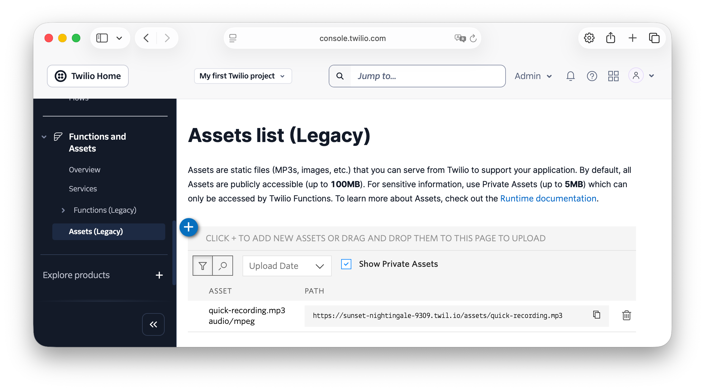

<!-- markdownlint-disable MD013 -->

# Twilio / Slim MP3 Voice Call

This is a small PHP application that shows how to play MP3 audio in a [Twilio voice call][twilio-programmable-voice] using [the Slim Framework][slim-framework].

## Overview

The application itself isn't meant to be all that sophisticated, feature rich, or to be written with production-ready code.
Rather, it shows just what needs to be done to build a working application.
Please keep that in mind.

## Prerequisites

You'll need the following to use the application:

- A Twilio account with a phone number that can receive phone calls.
  [Sign up for free today][twilio-signup] if you don't have an account.
- PHP 8.4 or above
- [Composer][composer] installed globally
- [ngrok][ngrok] for testing the application locally
- A mobile phone that can make calls
- Your preferred code editor or IDE (such as PhpStorm or neovim)
- Some terminal experience is helpful, though not required

## Quick Start

To start using the application, clone the repository wherever you store your PHP apps, change into the cloned project, and install the project's dependencies by running the following commands.

```bash
git clone git@github.com:settermjd/twilio-slim-mp3-voice-call.git
cd twilio-slim-mp3-voice-call
composer install \
  --no-dev --no-ansi --no-plugins --no-progress --no-scripts \
  --classmap-authoritative --no-interaction \
  --quiet
```

Then, you need set the required environment variables in _.env_.
These are:

| Environment Variable | Description                                                                                                                                              |
| -------------------- | -------------------------------------------------------------------------------------------------------------------------------------------------------- |
| `AUDIO_FILE`         | This is the name of the MP3 file that you want to play to the caller.                                                                                    |
| `PUBLIC_URL`         | This is the base URL of the running PHP application (whether running locally, remotely, or made publicly available using a tool such as [ngrok][ngrok]). |
| `TWILIO_ASSETS_URL`  | This is the full path to an MP3 file hosted as [a Twilio Asset][twilio-assets].                                                                          |

## Start the Application

After the environment variables are set, start the application listening on port 8080 with PHP's built-in webserver, by running the following command:

```bash
php -S 0.0.0.0:8080 -t public/
```

Then, in a new terminal tab or session, expose it to the public internet by running the following command:

```bash
ngrok http 8080
```

Now, configure calls to your Twilio phone number to send a webhook to your application.
To do that, [in your Twilio Console][twilio-console]:

- Navigate to **Develop > Phone Numbers > Manage >** [Active Numbers][twilio-console-active-numbers]
- Select your active Twilio phone number
- In **Voice Configuration**, set:
    - **Configure with** to "Webhook, TwiML Bin, Function, Studio Flow, Proxy Service"
    - **A call comes in** to "Webhook"
        - It's **URL** to your ngrok **Forwarding URL**
        - It's **HTTP** field to "HTTP GET"
    - Scroll down and click **Save configuration**

## Set the required environment variables

Now, in _.env_, either set the `AUDIO_FILE` and `PUBLIC_URL` variables or the `TWILIO_ASSETS_URL` variable.
If you set `AUDIO_FILE` and `PUBLIC_URL`:

- `PUBLIC_URL` must be set to the base URL of your application, which would be either "<http://localhost:8080>", or the ngrok **Forwarding** URL, e.g., "<https://e70b7f6082bb.ngrok-free.app>".
- `AUDIO_FILE` must be set to the name of a readable MP3 file in the project's _assets_ directory.

If you set `TWILIO_ASSETS_URL`, set it to the Twilio Asset's URL available in the Asset's PATH column when viewing [the Assets list (Legacy) section][twilio-assets-legacy-list] of the Twilio Console.
You can see an example of the page in the screenshot below.



## Test the application

Now, ring your Twilio phone number.
You should hear your MP3 file played back to you.

## Contributing

If you want to contribute to the project, whether you have found issues with it or just want to improve it, here's how:

- [Issues][github-issues]: ask questions and submit your feature requests, bug reports, etc
- [Pull requests][github-prs]: send your improvements

## Did You Find The Project Useful?

If the project was useful and you want to say thank you and/or support its active development, here's how:

- Add a GitHub Star to the project
- Write an interesting article about the project wherever you blog

## License

[MIT][mit-license]

## Disclaimer

No warranty expressed or implied. Software is as is.

<!-- Links -->

[composer]: https://getcomposer.org
[github-issues]: https://github.com/settermjd/twilio-slim-mp3-voice-call/issues
[github-prs]: https://github.com/settermjd/twilio-slim-mp3-voice-call/pulls
[mit-license]: http://www.opensource.org/licenses/mit-license.html
[ngrok]: https://ngrok.com
[slim-framework]: https://www.slimframework.com
[twilio-assets]: https://www.twilio.com/docs/serverless/functions-assets/assets#using-public-assets
[twilio-assets-legacy-list]: https://console.twilio.com/us1/develop/functions/assets-classic?frameUrl=%2Fconsole%2Fassets%2Fpublic%3Fx-target-region%3Dus1
[twilio-console]: https://console.twilio.com
[twilio-console-active-numbers]: https://console.twilio.com/us1/develop/phone-numbers/manage/incoming
[twilio-programmable-voice]: https://www.twilio.com/docs/voice#get-started
[twilio-signup]: https://twilio.com/try-twilio

<!-- markdownlint-enable MD013 -->
